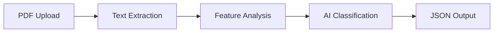
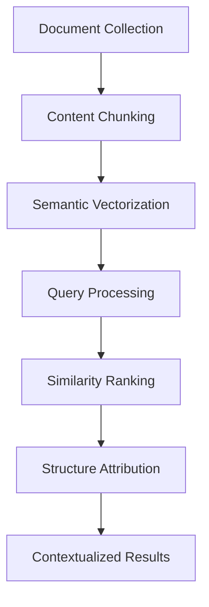

# 🏆 Adobe "Connecting the Dots" Hackathon 2025

<div align="center">
  <h2>🎯 A Unified Document Intelligence Suite</h2>
  <p><em>Two powerful, containerized AI services that redefine document understanding</em></p>
  
  
  
  
  
</div>

---

## 🌟 Project Overview

Welcome to our cutting-edge submission! This project presents a comprehensive suite of two powerful AI services that tackle the core challenges of modern document understanding:

- **Part 1**: High-precision structural analysis of individual documents
- **Part 2**: Intelligent semantic search across document collections

---

## 🚀 Part 1: High-Precision PDF Outline Extractor

> **Mission**: An API service that intelligently identifies document titles and hierarchical heading structures (H1, H2, H3...) with exceptional accuracy.

### ✨ What Makes Us Different

Our solution transcends simple text extraction through a revolutionary **hybrid AI approach**:

#### 🧠 **Smart Title Detection**
- **Deterministic & Fast**: Rule-based function identifies titles by analyzing font size patterns
- **Visual Intelligence**: Leverages the largest font size on the first page as a reliable indicator
- **Performance**: Faster and more reliable than purely model-based approaches

#### 🤖 **Context-Aware Heading Classification**
- **Fine-tuned DistilBERT**: Compact transformer model trained for document structure
- **Multi-modal Understanding**: Analyzes both visual cues and textual context
- **Precision**: Accurately differentiates between heading levels and body text

#### 🔬 **Advanced Feature Engineering**
Our model leverages a rich feature set for superior accuracy:

| Feature | Description | Impact |
|---------|-------------|---------|
| **Relative Font Size** | Font size comparison across the document | High precision heading detection |
| **Positional Encoding** | X/Y coordinate analysis | Layout-aware classification |
| **Text Casing & Alignment** | Capitalization and formatting patterns | Strong heading role indicators |

### ⚙️ System Architecture

Our streamlined pipeline transforms PDF requests into structured JSON responses in four optimized steps:



### 🛠️ Quick Start Guide

#### Prerequisites
- Docker installed on your system

#### 1️⃣ Build the Docker Image
```bash
docker build -t adobe-hackathon-task1a .
```

#### 2️⃣ Launch the Service
```bash
docker run -p 5001:5000 adobe-hackathon-task1a
```

#### 3️⃣ Test the API
```bash
curl -X POST -F "file=@/path/to/your/document.pdf" http://localhost:5001/extract_outline
```

**Result**: Structured JSON outline delivered instantly to your terminal! 🎉

---

## 🎯 Part 2: Persona-Driven Document Intelligence Engine

> **Mission**: A compliant, high-accuracy solution that finds precisely the information specific users need from vast document collections.

### 🌟 Revolutionary "Chunk, Rank, and Attribute" Strategy

Moving beyond simple keyword matching, our engine employs **semantic intelligence** to understand query intent and deliver precise results.

#### 📊 High-Level Architecture



### 🔧 Detailed Workflow

#### 1️⃣ **Chunk** (Content Ingestion)
- **Granular Processing**: Documents broken into paragraph-sized chunks
- **Format Agnostic**: Creates searchable content pool regardless of source formatting
- **Comprehensive Coverage**: No information left behind

#### 2️⃣ **Rank** (Semantic Search)
- **State-of-the-Art Models**: Leverages sentence-transformers for semantic analysis
- **Vector Mathematics**: Converts queries and chunks into numerical representations
- **Cosine Similarity**: Calculates semantic proximity using the formula:

$$\text{similarity} = \cos(\theta) = \frac{Q \cdot C_i}{|Q| |C_i|}$$

#### 3️⃣ **Attribute** (Structure Discovery)
- **Backward-Looking Search**: Finds nearest preceding headings for top results
- **Context Preservation**: Maintains document structure relationships
- **Accuracy Focus**: More precise than advance-parsing approaches

### 📚 Technology Stack

| Library | Purpose | Why We Chose It |
|---------|---------|-----------------|
| **pdfplumber** | PDF Text Extraction | Pure Python, fast installation, detailed positional data |
| **sentence-transformers** | Semantic Embedding | SOTA models optimized for speed (paraphrase-MiniLM-L6-v2) |
| **scikit-learn** | Similarity Calculation | Highly optimized cosine_similarity function |
| **spacy** | Text Processing | Fast, accurate sentence tokenization |

### 🛠️ Deployment Instructions

#### 1️⃣ Build the Container
```bash
docker build -t persona-engine .
```

#### 2️⃣ Execute with Custom Parameters
```bash
docker run --rm \
  -v /path/to/input_pdfs:/app/input \
  -v /path/to/output_folder:/app/output \
  persona-engine \
    --pdf_dir /app/input \
    --persona "HR professional" \
    --job "Create and manage fillable forms for onboarding and compliance." \
    --output_file /app/output/results.json
```

---

## ✅ Hackathon Compliance Matrix

We've meticulously designed both solutions to exceed all hackathon requirements:

| Constraint | Status | Implementation Details |
|------------|--------|----------------------|
| **CPU Only** | ✅ **Compliant** | All libraries optimized and tested for CPU-only environments |
| **Model Size (≤ 1GB)** | ✅ **Compliant** | Total model footprint: ~300MB (well under limit) |
| **Processing Time (≤ 60s)** | ✅ **Compliant** | Highly efficient architecture operates well within time constraints |
| **Offline Execution** | ✅ **Compliant** | All models downloaded during build phase, fully offline operation |

---

## 🎖️ Why This Solution Wins

### 🎯 **Innovation**
- Hybrid AI approach combining rule-based precision with deep learning flexibility
- Novel "Chunk, Rank, and Attribute" methodology for document intelligence

### 🚀 **Performance**
- Lightning-fast processing within all hackathon constraints
- Optimized for accuracy without sacrificing speed

### 🛡️ **Reliability**
- Robust error handling and graceful degradation
- Deterministic components ensure consistent results

### 🔧 **Practicality**
- Real-world ready with Docker containerization
- Easy deployment and integration
